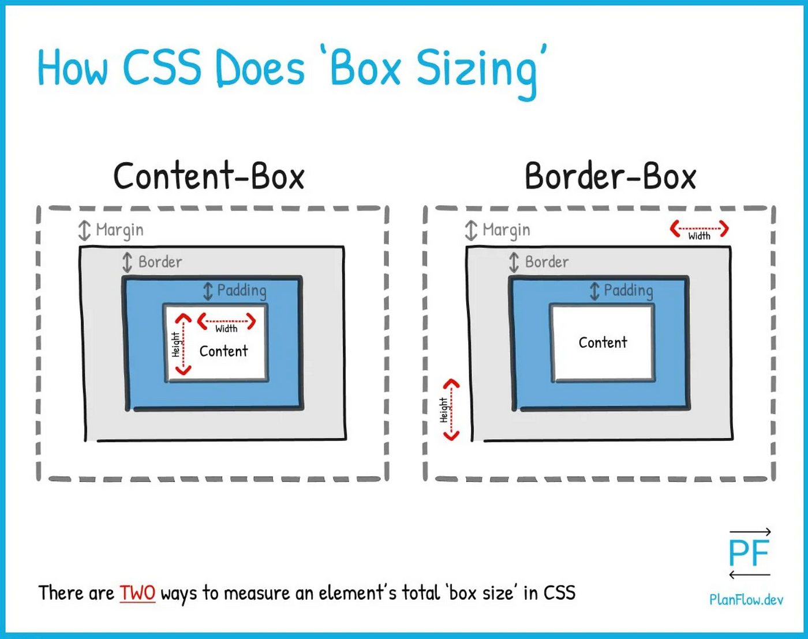

# 📏 CSS `box-sizing` Cheat Sheet

The `box-sizing` property controls how the total size of an element is calculated.



## 🔹 `content-box` (Default)

- The **width/height applies only to the content**.
- **Padding and border are added outside** the width/height.
- This can make elements larger than expected.

```css
.box {
  box-sizing: content-box;
  width: 200px;
  padding: 20px;
  border: 5px solid black;
}
```

🧮 Total rendered width = `200 + 20*2 + 5*2 = 250px`

---

## 🔸 `border-box` (Recommended)

- The **width/height includes padding and border**.
- This makes layout easier and more predictable.

```css
.box {
  box-sizing: border-box;
  width: 200px;
  padding: 20px;
  border: 5px solid black;
}
```

🧮 Total rendered width = `200px` (includes content, padding, and border)

---

## ✅ Best Practice

Use `border-box` globally to simplify layout sizing:

```css
*,
*::before,
*::after {
  box-sizing: border-box;
}
```

This ensures all elements calculate their size more intuitively.

---

## 🧠 Summary Table

| Value         | Includes Padding & Border in Width/Height? | Easy Layout? |
| ------------- | ------------------------------------------ | ------------ |
| `content-box` | ❌ No                                      | ❌ Tricky    |
| `border-box`  | ✅ Yes                                     | ✅ Easier    |

---
